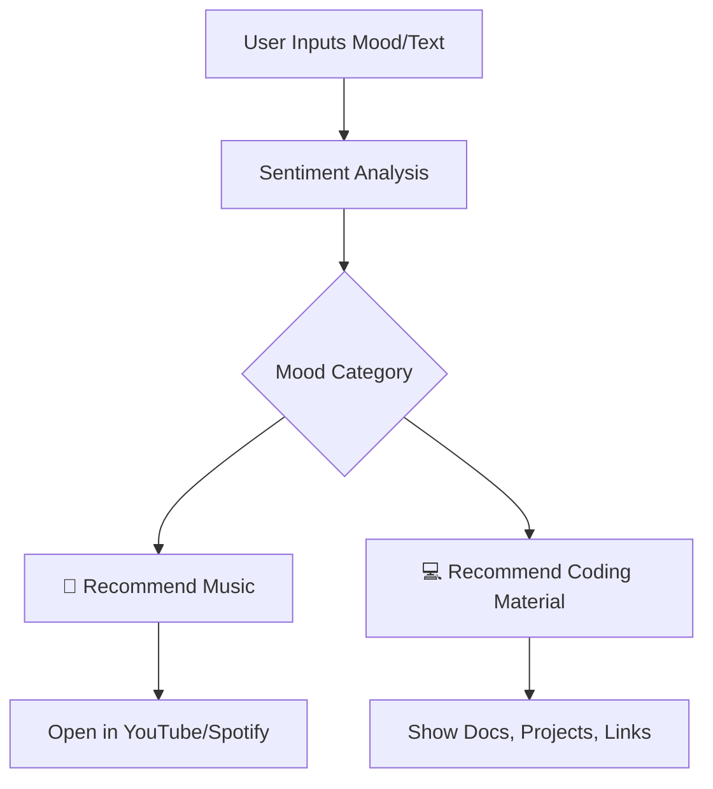

<p align="center">
  
</p>

<h1 align="center">🎧 VibeSync</h1>
<p align="center">AI-powered Mood-Based <b>Music</b> + <b>Code</b> Recommender 🎶💻</p>

---

## 🌈 What is VibeSync?

> VibeSync is your AI buddy that understands your mood and instantly suggests the **perfect music** to vibe with and the **right coding resources** to boost your productivity or chill time.  
> Feeling 🔥 pumped, 😌 calm, 😓 stressed, or 🤯 brain-fried? VibeSync's got your back.

---

## ⚙️ Tech Stack

| Component      | Tech Used                        |
|---------------|----------------------------------|
| Language       |  |
| Interface      | `Tkinter` / `PyQt5` *(customizable)* |
| AI Models      | `scikit-learn`, `transformers`, `textblob` |
| Music Source   | 🎵 Spotify API, YouTube API      |
| Extras         | `OpenAI API`, `Emotion Detection` |

---

## 🎥 Demo (Coming Soon)

> *(Insert a YouTube video link or GIF demo here)*  
> You can use [Loom](https://www.loom.com/) or [Screenity](https://chrome.google.com/webstore/detail/screenity) to record easily!

---

## 📸 Interface Preview

| Mood Detected | Music Suggested | Coding Resources |
|---------------|-----------------|------------------|
| 😊 Happy       | Upbeat Pop 🎶     | LeetCode Patterns |
| 😐 Neutral     | Lo-fi Chill 🎧     | Python Refresher  |
| 😔 Sad         | Soft Piano 🎹     | Mindful Dev Blogs |
| 😵 Stressed    | Nature Sounds 🍃   | Debugging Tutorials |

> *(Add screenshots like this below)*
<p align="center">
  
</p>

---

## 🧠 How It Works



---

## 💡 Features Coming Soon

- 🎙️ Voice-based mood detection  
- 📷 Webcam emotion recognition  
- 🧘 Mood history tracker  
- 🔗 Spotify & LeetCode integration  
- 🎛️ Personalized playlists & productivity timers  

---

## ✨ Contribution Guide

We welcome collaborators and contributors! 🤝  
Want to contribute new ideas, features, or UI improvements? Join in!

```bash
# Fork the repo
# Create your feature branch
git checkout -b feature/AmazingFeature

# Commit your changes
git commit -m 'Add some AmazingFeature'

# Push to GitHub
git push origin feature/AmazingFeature

# Open a Pull Request 🚀

```
---
## Output

<p align="center">
  
</p>


## 👨‍💻 Author

**Chanchal Chavhan**  
- 🎓 2nd Year, Electronics & Telecommunication Engineering  
- 🏫 Sanjivani College of Engineering, Kopargaon  
- 🧠 Passionate about AI, IoT & Smart Interfaces  
- 📫 Email: [chanchalkarnachavhan@gmail.com](mailto:chanchalkarnachavhan@gmail.com)  
- 🌐 Portfolio: [Click Here](https://github.com/CHANCHALCHAVHAN)


